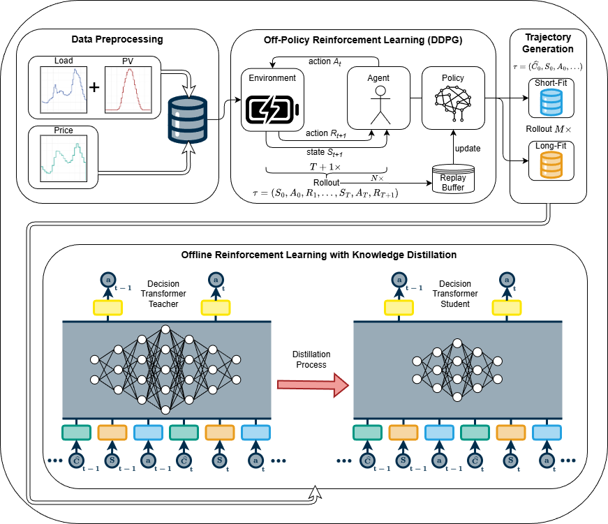

# Efficient Battery Energy Storage Control Using Decision Transformers and Knowledge Distillation
The increasing integration of renewable energies, particularly photovoltaic systems, can lead to significant fluctuations between electricity generation and consumption. This development introduces considerable operational challenges and necessitates adopting flexible demand response strategies and deploying advanced Home Energy Management Systems (HEMSs). By coordinating resources such as heat pumps, electric vehicles, and battery storage, HEMSs can lower costs, improve photovoltaic self-consumption, and enhance grid stability under dynamic pricing. However, conventional rule-based and model-predictive control methods often fail under highly variable conditions or rely on forecasts that are difficult to maintain in practice. These challenges motivate the use of machine learning methods such as Reinforcement Learning (RL), although RL can also introduce additional limitations. To address the resulting shortcomings, this thesis explores the Decision Transformer (DT) as an offline, sequence-modelled RL approach for residential energy management trained exclusively on pre-collected behavioural data. Experiments across multiple buildings reveal that leveraging diverse, multi-building datasets improves the robustness and consistency of the learned control policies. In comprehensive evaluations, the DT can surpass its behavioural pre-collected baseline in specific experimental settings, while still exhibiting headroom to close the gap with the optimisation-based reference model. To support deployment in practical environments, this work further investigates Knowledge Distillation (KD) as a strategy to reduce model complexity without sacrificing control quality. Results show that model size can be reduced by up to 96%, with only a minimal (0.5 percentage point) decrease in performance. These findings indicate that efficient, sequence-modelled controllers, when trained on heterogeneous data and compressed via KD, offer a scalable and practical solution for effective HEMS deployment, even in resource-constrained environments.

